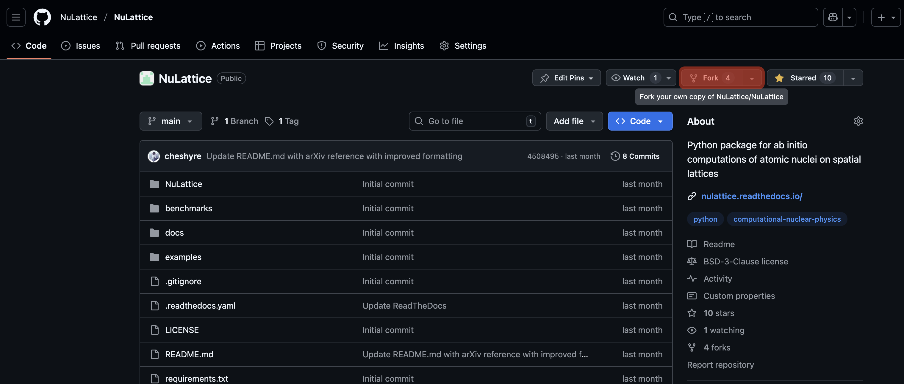
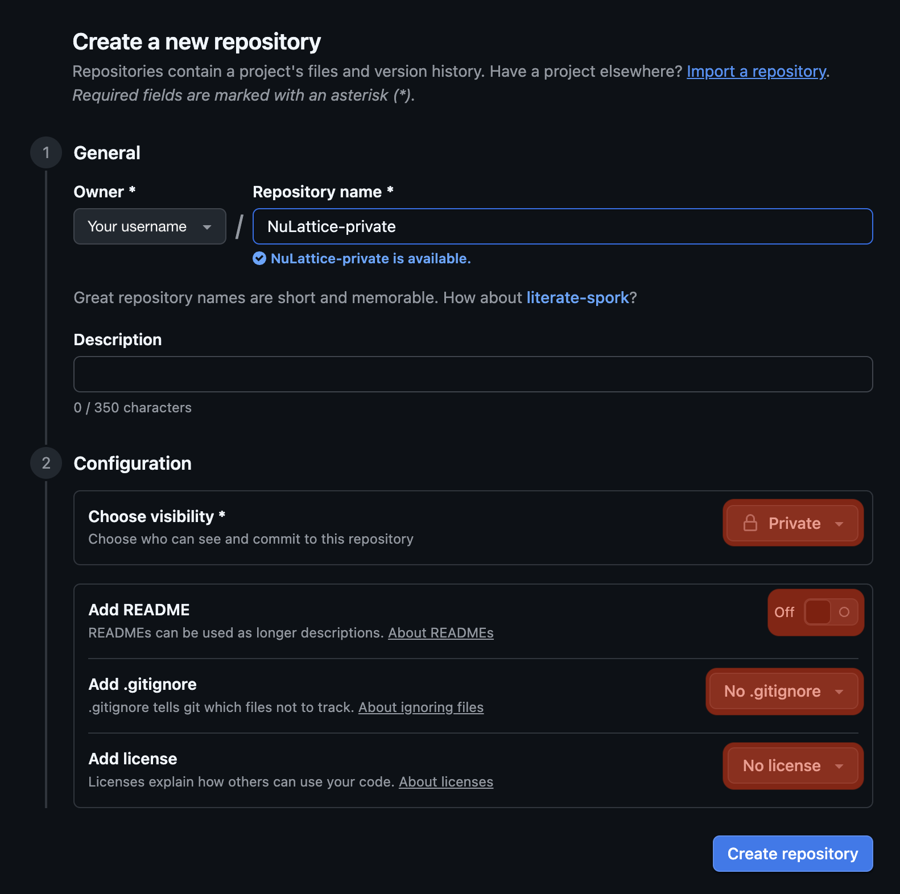

# Recommended steps for contributors

Contributors to `NuLattice` should follow the general steps of:
1. [Forking](https://github.com/NuLattice/NuLattice/fork) the repository;
2. Adding new developments, fixes, optimizations, or other contributions in a new branch (not `main`);
3. And merging their contributions back to the main repository via a [pull request](https://github.com/NuLattice/NuLattice/pulls).

Below we provide instructions on how contributors can do this step by step, including instructions on making new developments private until they are ready to be made public and merged back into the main repository.

## Forking the repository

To fork `NuLattice`, simply click the button on the top right of [the main repository page](https://github.com/NuLattice/NuLattice):



The button is highlighted in red. This creates a new repository forked from `NuLattice` at the url `https://github.com/[your Github username]/NuLattice`. You can modify the fork however you like, including adding collaborators, and you will use the fork to contribute your developments and improvements back to `NuLattice` once they are ready (see below).

Now that you have a fork of `NuLattice`, simply clone the remote repository:
```
git clone https://github.com/[your Github username]/NuLattice
```
to obtain a local repository that you can develop.

## Developing a branch

We strongly encourage contributors to create new branches for their work. Creating a branch to develop a new feature allows the `main` branch of your fork to be easily synchronized with the main `NuLattice` `main` branch. This can simplify the process of merging back to the main `NuLattice` repository significantly.

To work with a new branch for a feature, create the branch in your local repository:
```
git checkout -b [feature branch name]
```
and push the branch to the Github remote:
```
git push --set-upstream origin [feature branch name]
```

You can then develop new features for `NuLattice` following standard practices. If you are unfamiliar with `git`, consider reading the [Github git basics guide](https://github.com/git-guides#learning-git-basics).

## Managing a private `NuLattice-private` development repository (optional)

All contributions to `NuLattice` will be public. However, some contributors may wish to keep their developments private until some point before they merge their developments to the main repository. There could be numerous reasons for this, including ensuring that new developments are correct or waiting until first science results are written up. On Github, forks of public repositories are public and cannot be made private. Below, we describe a strategy to keep `NuLattice` developments private while staying connected to the public forked and main repositories.

Once you have forked `NuLattice`, cloned it locally, and created a new development branch, create a [new private repository on Github](https://github.com/new):



We suggest naming the repository `NuLattice-private`. Make sure to set the visibility to private (public will be default), and ensure that no `README`, `.gitignore`, or `LICENSE` is added during creation. We need the `NuLattice-private` repository to be completely empty.

Once you create the repository, it will be completely empty. At this point, from your local repository of `NuLattice`, you will configure `NuLattice-private` as a new remote for the local repository:
```
git remote add private https://github.com/[your Github username]/NuLattice-private.git
```
This now has defined the remote `private` as a remote repository for your local copy of `NuLattice` (to be contrasted with `origin` for the public remote repository).

To synchronize your `main` and feature branches with `NuLattice-private`, simply type:
```
git push -u private main
git push -u private [feature branch name]
```
You should now see that `https://github.com/[your Github username]/NuLattice-private` and `https://github.com/[your Github username]/NuLattice` look more or less the same.

You can now develop locally and push your local changes to `NuLattice-private`, which you may share with collaborators, without needing to make any developments public. To push local changes to `NuLattice-private` rather than `NuLattice` by default, set the upstream to `private`:
```
git push --set-upstream private [feature branch name]
```

Once your changes are ready to be made public, push them to `NuLattice`:
```
git push -u origin [feature branch name]
```

